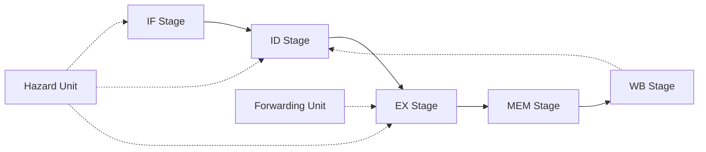

# BITSillicon RISC-V: Team Work Breakdown

> [!NOTE]
> This document outlines the work division for our 14-member team building the RV32I 5-Stage Pipelined RISC-V Processor. Assign names to the tasks below to get started.

## Architecture Overview

## Roles and Assignments

| # | Role / Sub-project | Description | Key Files | Assignee |
|---|---|---|---|---|
| 1 | **Architecture Spec & Top Integration** | Top-level design and inter-module interface | `riscv_top.v`, `docs/*.md` |  |
| 2 | **IF Stage** | PC register, instruction memory, IF/ID register | `pc_reg.v`, `instr_mem.v`, `if_id_reg.v` |  |
| 3 | **Instruction Decoder** | Field extraction from 32-bit instruction word | `instr_decoder.v` |  |
| 4 | **Immediate Generator** | All six RV32I immediate encodings | `imm_gen.v` |  |
| 5 | **Register File** | 32x32 register file with two read ports | `reg_file.v` |  |
| 6 | **Control Unit** | Main decoder and ALU control logic | `main_decoder.v`, `alu_decoder.v` |  |
| 7 | **ALU** | All RV32I arithmetic and logic operations | `alu.v` |  |
| 8 | **Branch and Jump Unit** | Condition evaluation and target computation | `branch_unit.v` |  |
| 9 | **ID/EX Pipeline Register** | EX stage mux and pipeline stage boundary | `id_ex_reg.v` |  |
| 10 | **EX/MEM Register + MEM Stage** | Data memory and load/store extension | `ex_mem_reg.v`, `data_mem.v`, `load_extend.v` |  |
| 11 | **MEM/WB Register + Write-Back** | Result mux and register file write path | `mem_wb_reg.v`, `writeback.v` |  |
| 12 | **Hazard Detection Unit** | Stall and flush signal generation | `hazard_detect.v` |  |
| 13 | **Forwarding Unit** | EX-EX and MEM-EX forwarding paths | `forward_unit.v` |  |
| 14 | **Verification and Testbench** | Unit and integration testbenches, test programs | `tb/*`, `programs/*` |  |

---

## Work Packages Details

### Package A: Core Pipeline Control
**Members:** 1, 6, 14
**Focus:** The orchestrators of the processor. You will define how everything connects, generate control signals, and ensure the processor works as a whole.

- **Member 1 (Top Integration):** Focuses on the big picture. You will define module interfaces and stitch everything together in `riscv_top.v`.
- **Member 6 (Control Unit):** The brain. You will decode opcodes and generate signals like `RegWrite`, `MemRead`, and `ALUControl`.
- **Member 14 (Verification):** The judge. You will write unit tests and integration tests in `tb/` to verify everyone's work against expected behavior.
<!-- slide -->
### Package B: Front-End
**Members:** 2, 3, 4
**Focus:** Fetching and decoding instructions. 

- **Member 2 (IF Stage):** Manages the PC and Instruction Memory.
- **Member 3 (Instruction Decoder):** Slices the 32-bit instruction into `rs1`, `rs2`, `rd`, `opcode`, etc.
- **Member 4 (Immediate Generator):** Handles sign extension for I, S, B, U, J format immediates.
<!-- slide -->

### Package C: Execution & Branching
**Members:** 5, 7, 8, 9
**Focus:** The heavy lifting. Executing arithmetic and deciding branch paths.

- **Member 5 (Register File):** Safely storing and reading the 32 general-purpose registers.
- **Member 7 (ALU):** Implementing `ADD`, `SUB`, `XOR`, `SLL`, etc., and setting flags.
- **Member 8 (Branch/Jump Unit):** Evaluating branch conditions and computing target addresses.
- **Member 9 (ID/EX Register):** Managing the boundary and passing data to the execution stage.
<!-- slide -->
### Package D: Memory, Writeback & Hazards
**Members:** 10, 11, 12, 13
**Focus:** Memory access, result finalization, and keeping the pipeline flowing smoothly.

- **Member 10 (MEM Stage):** Handling data memory reads/writes and load extensions (`LB`, `LH`).
- **Member 11 (WB Stage):** Selecting final results and routing them back to the Register File.
- **Member 12 (Hazard Unit):** Detecting load-use stalls and branch flushes.
- **Member 13 (Forwarding Unit):** Creating EX-EX and MEM-EX bypass paths to resolve data hazards without stalling.

